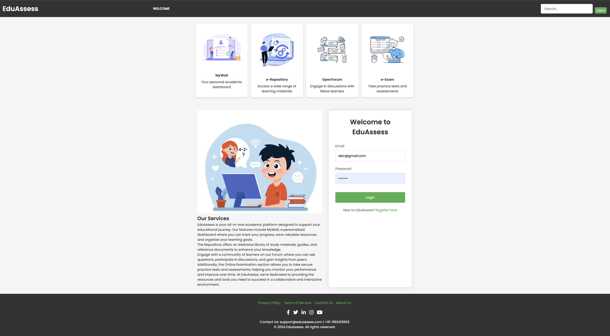
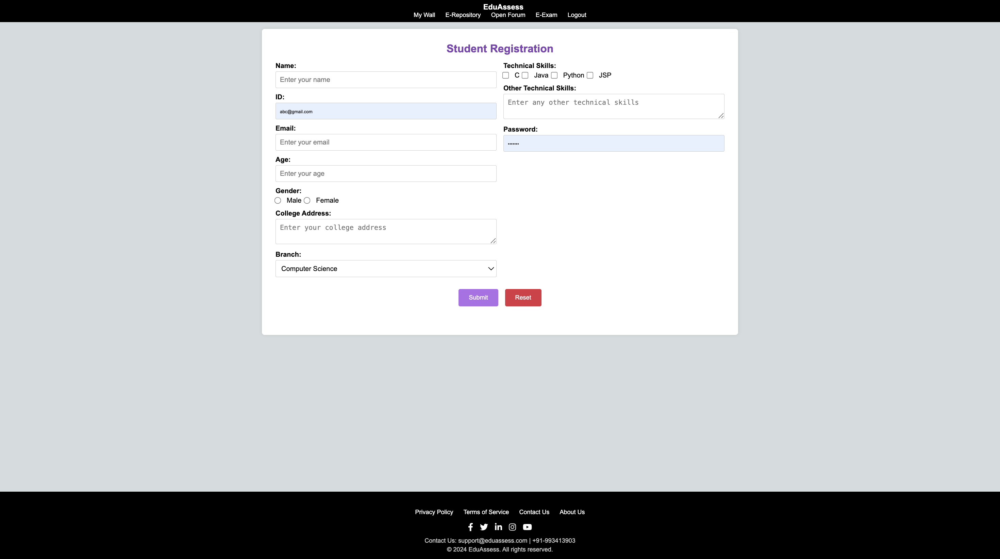
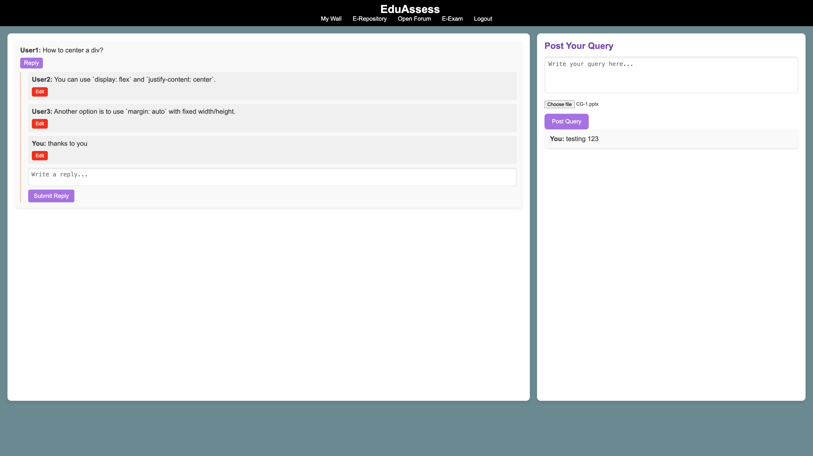
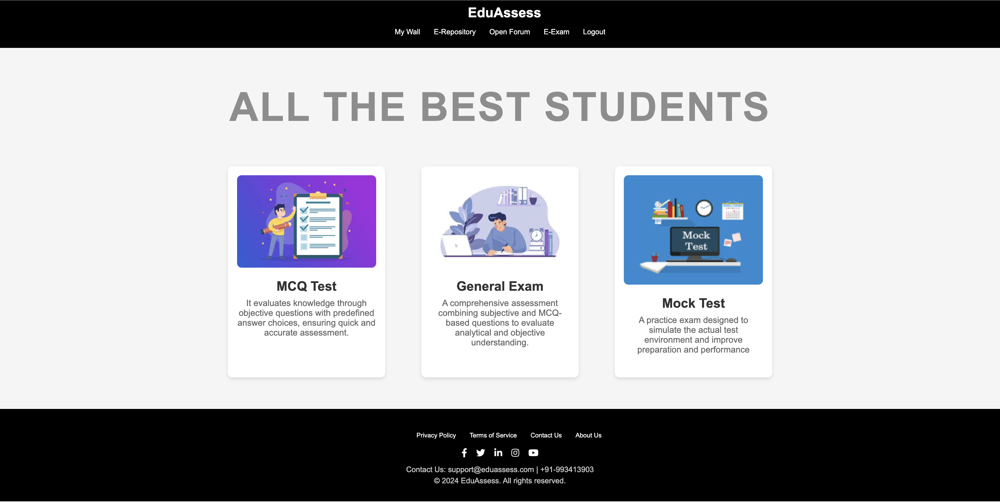
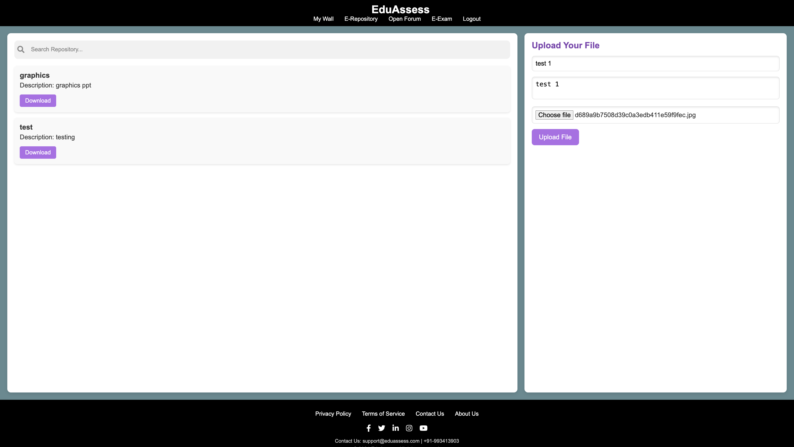

# ExamPortal

**ExamPortal** is a web-based platform built to streamline online examination processes for students. It provides secure login, exam creation, timed assessments, and result management — all with a responsive and modern UI.

---

##  Features

- **Student & Admin Authentication**
- **Exam Registration & Participation**
- **Timed Exams with Display of Results**
- **Secure Authentication via Firebase**
- **Data stored using Firebase Firestore**

---

## Screenshots

### Home Page  

### Registration Page  

### Open Forum  

### E-Exam 

### E-Repository 

---

## Tech Stack

#### HTML, CSS:    Frontend layout and styling              
#### JavaScript:   Dynamic interactivity                    
#### Firebase:     Authentication & Firestore for data      
        
---
## Collaborators

- **Khusi Pandey**  
- **Laurina Patnaik**

